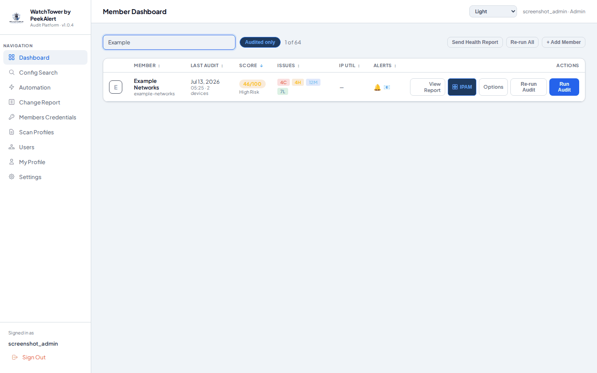
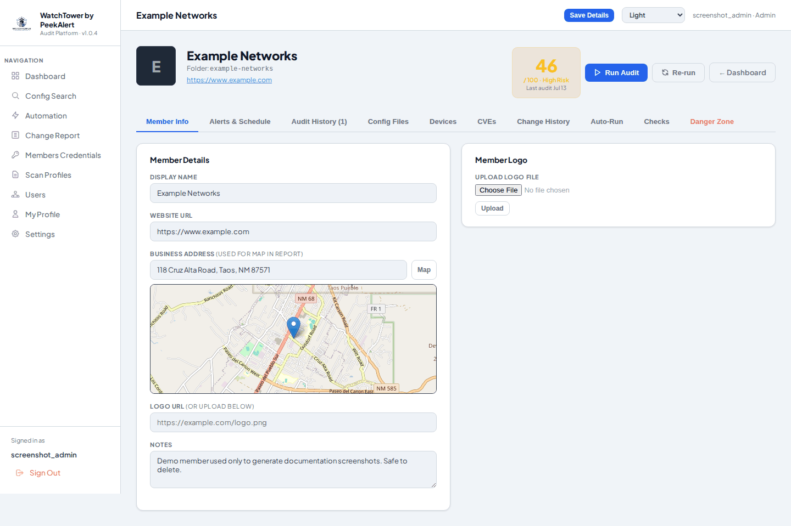
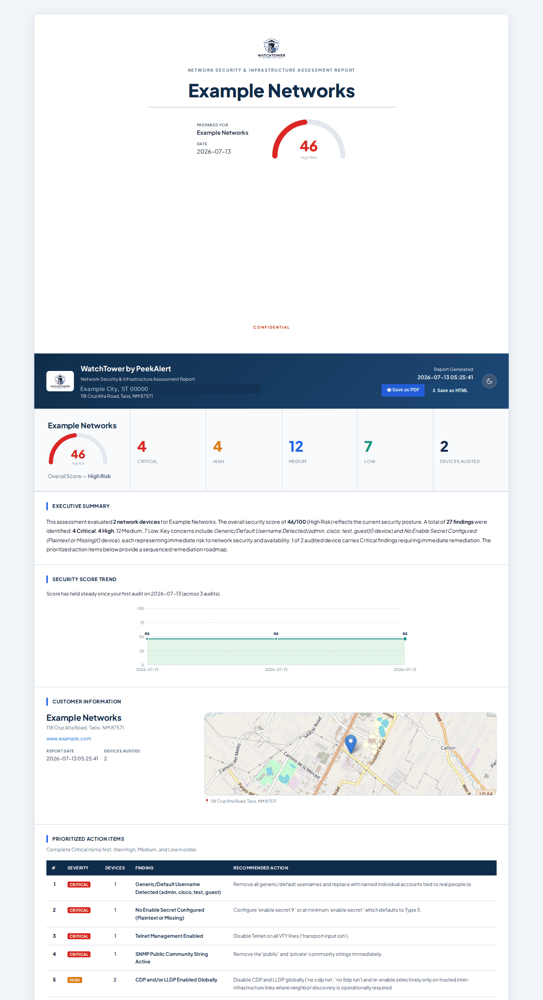
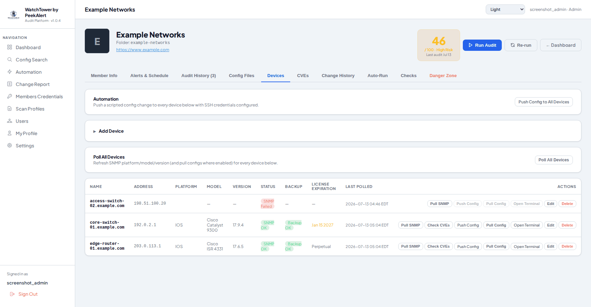
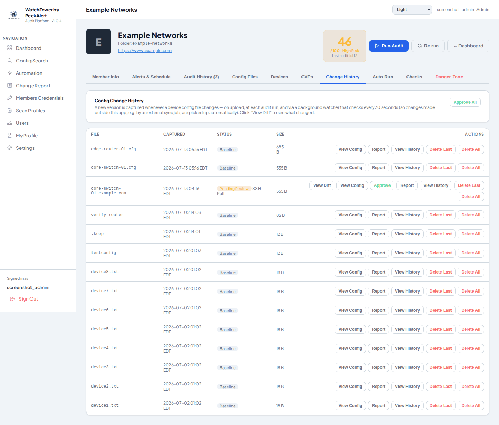
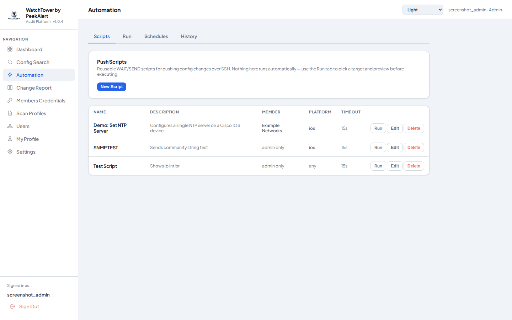
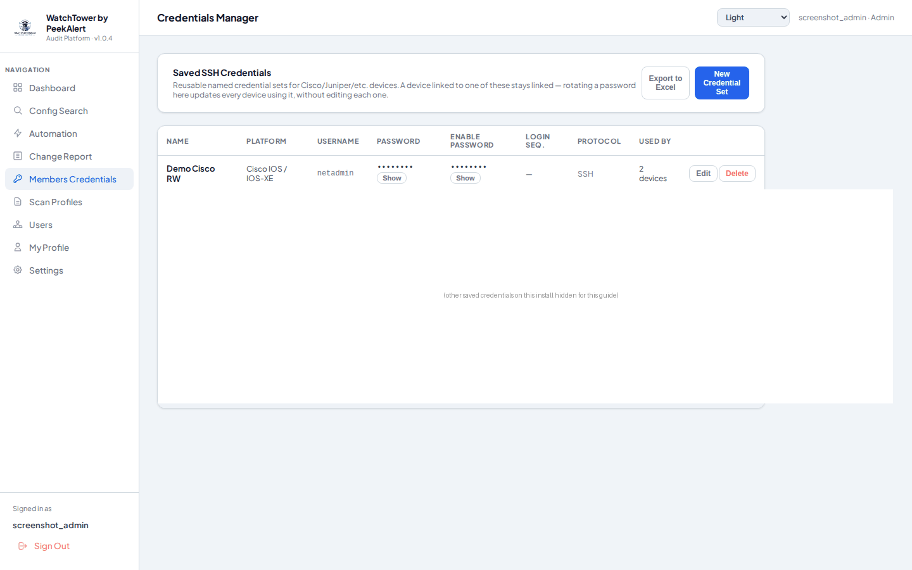

# WatchTower

A multi-user web platform for network device security auditing **and** day-to-day network management. On the audit side, it analyzes Cisco IOS, NX-OS, JunOS, Arista EOS, and other device configuration files for security misconfigurations, scores each member network, and delivers alerts and reports automatically. On the management side, it's a working NCCM (network configuration and change management) system in its own right: it inventories devices via SNMP/SSH, pulls and version-controls running-configs with full change-history and diffing, pushes configuration changes through a scripted automation engine, gives you a live in-browser SSH terminal, tracks CVEs against each device's detected platform/version, and manages the credentials all of that runs on — all from the same dashboard, with the same multi-tenant access model.

> **This repository hosts compiled release downloads only.** Source code is maintained in a private repository and is not published here — see the [Releases](../../releases) tab for the latest build.

---

## Screenshots

All screenshots below use a synthetic demo member ("Example Networks") with placeholder devices/addresses — no real customer data.

**Dashboard** — every member's score, alerts, and IP utilization at a glance


**Member overview** — audit score, location map, and every management tab in one place


**Audit report** — scored findings with a prioritized remediation roadmap, exportable as HTML/PDF


**Device management** — SNMP/SSH polling, backup status, and per-device actions


**Config change history** — every device config version, diffed and approvable


**Automation** — scripted config push across one device or an entire fleet


**Credentials manager** — reusable, rotatable SSH credential sets


---

## Features

### Auditing & Reporting
- **Sortable dashboard** — Click any column header to sort by member name, last audit date, score, alert status, or issue count
- **Severity drill-down** — Click a C / H / M / L chip on the dashboard to see all findings at that severity level with per-finding score penalties
- **Per-member scoring** — Score averaged across all devices (100 − risk per device); weighted by severity
- **Re-run Audit** — Re-run the last audit with saved settings from the dashboard (inline % progress) or the member page
- **Run Audit auto-fill** — Opening Run Audit pre-fills customer name, business address, reviewing engineer, topology toggle, and ASN selection from the member's last audit run instead of a blank form; the business address also auto-populates from the audited ASN's registered organization address (via a public WHOIS lookup) whenever it's otherwise empty
- **Automated scheduling** — Re-run audits on a timer (1 day → 12 months). A member left on its default "Follow global default" setting automatically picks up whatever schedule is set in Settings → Audit Configuration, so a global schedule change applies fleet-wide without editing every member; a member can still override to its own interval, or be explicitly set to "Disabled" to never auto-run regardless of the global schedule. Only ever applies once a member has been audited manually at least once — a brand-new member isn't swept into a recurring schedule just for existing
- **HTML + PDF report export** — Full styled customer-facing reports, downloadable as a single self-contained HTML file (uploaded company logo is inlined as a data URI so it still renders once saved or emailed, rather than a broken link back to the server) or rendered to PDF. Defaults to light mode when opened outside the app (a saved/emailed copy has no access to your in-app theme preference)
- **Security Score Trend chart** — Customer reports show a score-over-time chart across all prior audits, with a plain-English improvement/decline summary
- **Device-level audit breakdown** — Per-device findings with new/resolved diffs against the prior audit
- **IPAM modal** — BGP prefix utilization with used/free subnet visualization and threshold alerting
- **Custom scan checks** — Build your own line-item checks (contains/does-not-contain word conditions with AND/OR) in Scan Profiles, no regex required
- **Remote probe agent** — Delegate port scans to an external server to avoid false positives from inside the network
- **Location map** — Address geocoding with an embedded map on the member page and in exported reports, rendered from free OpenStreetMap data rather than a third-party embed that requires its own API key or account. The geocoded location and rendered map image are both cached after the first successful lookup for a given address, so later audits show the map instantly and keep showing it even if a transient network hiccup affects that particular run
- **Score trend indicator** — A small green (up) or red (down) trend icon next to each member's score on the dashboard shows which way its security score is moving. It walks back through that member's audit history to the last audit where the score actually differed, so a rerun that happens to tie the latest score doesn't hide a real trend from a few audits back
- **Editable, saveable network topology** — The auto-discovered topology diagram (L3 interfaces + upstream BGP links) is fully interactive: drag nodes to rearrange, click an edge to delete it, shift+drag node-to-node to add a link, double-click a node to delete it (and everything connected to it), or add a brand-new node (Router/Switch/Aggregation/Device/Cloud) from a small form. **Save Topology** persists the exact current layout — positions and manual edits included — to the member; **Use saved topology** on Run Audit reuses it exactly as saved instead of rebuilding from configs; a **Topology** button on the dashboard opens a standalone viewer of the saved diagram for any member that has one
- **Consistent dashboard actions** — Every member row always shows the same set of action buttons (View Report, IPAM, Topology, Options, Re-run Audit, Run Audit) in the same order; whichever isn't available yet for that member (no audit run yet, no saved topology, etc.) is shown grayed out with a tooltip explaining why, instead of the button disappearing and reshuffling the row
- **BGP Explorer** — A per-member tab that turns the eBGP peering data already resolved from configs into an actionable advertisement report:
  - **Dual-homed redundancy check** — Checks every one of the member's owned prefixes against every one of their transit/upstream peers directly (not just pairwise between peers), catching the gap where a prefix is only ever advertised to one upstream and would black-hole if that single link failed — including when an aggregate is only *partially* covered by a peer's more-specific advertisements, not just an exact aggregate-for-aggregate match. Runs as part of every normal audit and appears in the exported HTML/PDF report; can be turned off per member (Checks tab → Report Options) to skip the extra RIPE lookups for a member that doesn't need it
  - **Live visibility check** — Queries RIPE RIS + RouteViews to confirm each owned prefix is actually visible in the global routing table, automatically probing smaller sub-splits when an aggregate itself returns no observations (a common real-world case: a member advertises several smaller pieces of a block rather than the whole aggregate as one route)
  - **Provider visibility** — Breaks down live visibility by major transit provider (AT&T, Cogent, Hurricane Electric, Lumen, etc.) using the AS-path data already collected from the live check, so you can see which specific upstreams are and aren't carrying a given prefix
  - **Coverage diagram & matrix** — A visual diagram linking owned prefixes to upstream peers (solid = covered, dashed = gap) plus a prefix-by-peer matrix, both labeled by device hostname and IP so two sessions to the same provider from different routers (or the reverse — same IP, different routers) are never conflated
  - Both the redundancy check and the live visibility check refresh automatically once a day per member, and the last result stays visible on the BGP Explorer tab even before it's re-run again

### Config Change Tracking
- **Automatic change detection** — A background watcher hashes every device config file every 30 seconds and snapshots anything that changed
- **Diff viewer** — Diff of any config change against the current approved baseline, or full-file view
- **Version comparison** — Pick any two versions of a device's config from a dropdown and see a full side-by-side diff, not just against the baseline
- **Approve / Approve All workflow** — Mark a change as the new baseline that future diffs compare against
- **Ignore patterns** — Settings → Audit Configuration takes one standard Python regex per line; a config line matched by any of them (plain `.search()`, so no anchoring is required unless you add your own `^`/`$`) is excluded only from change-detection and diffing — the stored file itself is never touched, so View Config and every export/download still show the untouched original. A blank line, or one starting with `#`, is skipped when the list is read, so a pattern can be commented out without deleting it. The built-in defaults catch any vendor's auto-generated timestamp banner line (a "last saved"/"generated at" comment with a time, month name, or date) rather than needing an exact phrase per vendor, plus specific known-noisy lines found from real false positives (ASA's regenerated `Cryptochecksum:`, Juniper's `ntp clock-period`, various leaked SSH prep-command echoes)
- **Delete a version / Delete All** — Admins can permanently remove a specific version from a device's history (e.g. a bad/junk capture), or every version at once to fully clear a renamed/retired device's entry out of Change History — blocked per-version if that exact version is still referenced by a saved change report, so deleting it can't orphan that report's diff; an Automation push run pointing at it is cleared instead of blocking, since the run's pass/fail history is what's worth keeping, not that one snapshot
- **Per-device history** — One row per device in Change History, with a button to open the full version history for that device
- **Obtained Via tracking** — Every config file shows how its current content was actually obtained: Manual Upload, Remote Backup Pull, SSH Pull, Detected Change, or Audit Capture
- **Report Change** — Email a change notification (with a link back to the diff) to any recipient, with a saved record of who reported it and when
- **Scheduled digests** — Org-wide or per-member scheduled email with the actual diff content for every unapproved change (not just a list of device names), capped per device to keep the email readable, plus a full changed-device list; configurable Weekly/Bi-Weekly/3-Week/daily/monthly frequency, with the weekly-family frequencies also able to anchor to a specific day of the week (e.g. "every Monday"), not just an hour of the day; a Send Now button triggers the same digest on demand outside its schedule
- **Tenant-facing access** — Non-admin users see Change History for their assigned sites, with their own independent alert/digest email and schedule (view + Report Change only — Approve stays admin-only)
- **Config Search** — Grep-style search across device configs. From a member's Config Files tab, a dual-list device picker (same two-box-with-arrows UI as Automation's targeting) searches that member's own devices only; admins also get a separate global tool to select by whole member and/or individual device across every customer at once, with results shown grouped by member/device and line number
- **Change Report** — Global admin view listing every device across every member whose latest capture is still pending review, sortable by member or capture time, with the same View Change / Approve / View History / Delete Last actions as the per-member list, plus an Approve All that clears everything shown in one click
- **Cosmetic-change filtering** — Blank lines, a trailing device-prompt line, and vendor SSH-session banner noise (e.g. Arista's `!Command:`/`!Time:` lines, Cisco's `Building configuration...` / `Current configuration : N bytes`, ASA's `: Saved` / `: Serial Number:` / `: Hardware:` / `: Written by <user> at <time>` save-banner line, and a bare `!` section-separator line) are automatically excluded from change detection and diffs on top of configurable Ignore Patterns — regardless of whether the file came from an SSH pull, SCP pull, or manual upload — so cosmetic-only differences between two captures never trigger a false "changed" status. A password/secret line that's asterisk-masked on one pull and shown as its real value (or a differently-masked value) on another — some devices don't reliably echo the real value back every time — is likewise never flagged on its own: the two sides are compared against each other, and only the masked/unknowable value itself is neutralized, so a real change sharing that same line (a different username), a genuine value-to-value change (two different real hashes), or the line added/removed outright, all still register normally. A Cisco IOS self-signed/CA certificate rendered as a full inline hex dump on one pull and as an `nvram:` file reference on another is always treated as the same certificate, regardless of which representation a given pull happened to get
- **Junos format-flip protection** — A Juniper device's config can be captured as either flat `display set` statements or the classic hierarchical/braced tree, depending on which show-command a given pull happens to succeed with. Both representations are normalized to the same canonical form before change-detection and diffing, so a one-off fallback to the other format never shows up as a false "changed" status — and a real change made alongside a format flip still shows only the real change, not the reformatting noise
- **Change-detection stays correct as Ignore Patterns evolve** — Whether a config counts as "changed" is always decided against a live re-check of the previous version under today's Ignore Patterns, not a hash frozen under whatever patterns were active back when that version was captured — so editing/adding a pattern later can never retroactively make an already-approved version look like it changed
- **Bad-pull protection** — A capture that comes back drastically different from the previous version triggers one automatic re-pull to confirm it before it's ever recorded, so a truncated or garbled SSH read doesn't get mistaken for a real device change; a capture that comes back completely blank is rejected outright, since no device's config is ever legitimately empty; a config cut off mid-stream by a device's own unhandled pager prompt is also rejected outright and never recorded, regardless of vendor. A device's own CLI error/rejection text (invalid command, ambiguous command, incorrect input, permission denied, etc. — recognized across Cisco, Dell, FS.COM, and Nokia SR OS phrasing) is recognized and rejected the same way, rather than being stored as if it were the device's actual config — this matters even with the re-pull check above, since a *persistent* failure (e.g. an SSH account without enough CLI privilege) reproduces identically on re-pull and would otherwise be treated as a confirmed real change instead of the failure it actually is
- **SSH-session noise scrubbing** — A slow prep command's leftover response, a leaked device prompt glued directly onto the next command's echo with no separating space, and a dangling (often indent-aligned) `^` error marker from a rejected trailing pipe modifier are all recognized and stripped before a capture is ever stored — none of these are real config content, so none of them can trigger a false "changed" status
- **SSH-pull comparisons stay within SSH-pull history** — A device pulled via SSH only ever has its change-detection and diffs compared against its own prior SSH-derived captures, never against an unrelated manual upload or SCP-pulled file that happens to share the same filename — those can format or mask the same device's secrets differently, which would otherwise look like a false change
- **Change Report stays clean automatically** — Any pending item whose diff against its prior approved baseline is actually empty is auto-approved the instant the Change Report or a member's Change History is loaded, instead of sitting there for someone to click View Diff and find nothing — self-healing whenever a later Ignore Pattern or normalization fix means an already-flagged item no longer represents a real change
- **Reset Change History** — Admins can clear a member's entire config change history across every device at once from that member's Danger Zone tab (password confirmation required), so the next capture for every device becomes a fresh baseline — for starting change tracking over from a clean slate, not routine cleanup

### Remote Config Pull (SCP/SFTP)
- **Scheduled pull** — Pull a members folder from a remote server on a schedule via SFTP (paramiko), with SSH-key, password, or PuTTY `.ppk` key auth
- **Auto-registration** — Newly discovered member folders on the remote server are automatically added as dashboard members
- **Safe by design** — Additive-only sync (never deletes local files), skip-unchanged-file optimization, path-traversal protection, and host-key pinning (TOFU); a remote file is also skipped outright if its name matches a device that's separately configured for SSH pull, so the two mechanisms can never overwrite each other's capture of the same device — freed up again automatically the moment that device's SSH pull is disabled or removed
- **Live progress bar** — Manual "Pull Now" shows real-time file-by-file progress

### SNMP & SSH Device Polling
- **Add devices directly** — Add a device by IP or hostname on the member page instead of only working from uploaded config files
- **Bulk device import** — Add many devices at once from an uploaded `.csv` or `.xlsx` spreadsheet (name, address, SNMP/SSH fields, optional saved-credential reference) instead of one at a time, with a downloadable example file showing the exact columns and a per-row success/failure report
- **Connect & Add Device** — Turn an existing config file with no linked device yet into a fully polled one: enter SSH credentials and it actually connects and pulls a config before creating the device, so a failed attempt never leaves a broken device behind. **Bulk Connect & Add Devices** applies one set of credentials across many selected config files at once the same way
- **SNMP version/model polling** — Standard MIB-II/ENTITY-MIB OIDs, with vendor and version parsing for Cisco IOS/NX-OS, Juniper JunOS, Arista EOS, Dell/Force10, FS.COM/Fiberstore, and Nokia SR OS
- **SSH config pulling** — Full running-config retrieval over an interactive SSH session (not SNMP, which can't reliably return full config text on modern platforms), feeding straight into the same change-tracking history as uploaded/SCP-pulled configs — including Nokia SR OS's classic-CLI `admin display-config`. Juniper devices pull via `display set` (flat `set ...` statements) rather than the hierarchical/braced config tree, since a single setting changing then shows as a clean one-line diff in Change History instead of shifting brace-nesting context around it
- **Broad legacy SSH compatibility** — Connects to older network gear that modern SSH libraries dropped support for by default: `ssh-rsa` host keys, and the `diffie-hellman-group14-sha1`, `diffie-hellman-group-exchange-sha1`, and `diffie-hellman-group1-sha1` key-exchange algorithms — restoring support for hardware that would otherwise fail outright with "Incompatible ssh peer" before authentication is ever attempted
- **Automatic retry on connection failure** — A timeout, refused connection, or momentarily-busy jump host is retried up to 3 times with a short pause between attempts before being reported as failed; a rejected password is never retried, since that's not transient and repeated attempts risk tripping a device's own login lockout
- **Jumpbox / bastion host tunneling** — Route every device-facing SSH connection (config pull, the in-browser terminal, Automation push) and SNMP poll through one configured jump server instead of connecting to each device directly, for networks with no direct path to managed gear
- **Telnet support** — For gear that only ever supported Telnet, or has SSH disabled entirely: enable "Connect via Telnet" on that device's credential set (Credentials Manager) to skip SSH and connect straight over Telnet, tunneled through the jumpbox first if one is configured, falling back to a direct/local attempt if that fails too — since a jumpbox needed for other devices doesn't necessarily mean this one has no direct path. Not tried automatically just because SSH fails, since most SSH failures are a real problem with that attempt, not evidence of a Telnet-only device
- **Link to existing config files** — Add SNMP polling to a config file you already have (from upload or SCP pull) via a "+ SNMP" action, without creating a duplicate device
- **Independent schedules** — Separate global SNMP poll interval and SSH config-pull schedule; the SSH pull schedule can also be overridden per member, falling back to the global default when not set
- **Separate SNMP / Backup status** — The Devices tab shows SNMP reachability (SNMP OK/Failed) and the last SSH config pull's outcome (Backup OK/Failed) as two independent indicators, since a device can be reachable by one and not the other
- **On-demand Pull Config / Pull SNMP** — Grab a device's latest config or SNMP info right now, independent of its periodic auto-pull schedule
- **Poll All Devices** — Polls up to 5 devices concurrently instead of one at a time, so a full member sweep finishes in a fraction of the time, with a live time-remaining estimate based on the sweep's own observed pace
- **More reliable SSH config pulls** — Detects the device's actual CLI prompt to confirm a command has genuinely finished (instead of only inferring it from a quiet gap on the wire), and recovers automatically when a command's terminating keystroke doesn't register on the device's end, instead of misreading it as a rejected command; that recovery path is also fully scrubbed of SSH-session noise before being stored, so it can't trigger a false "config changed" alert
- **Begin Full SSH Pull Now** — Settings button that pulls every device with SSH credentials configured, across every member, right now — independent of each device's own schedule or auto-pull toggle — with a live progress bar and time estimate
- **12-hour SSH pull interval** — In addition to daily/weekly/monthly cadences, the global SSH Config Pull schedule can run every 12 hours
- **License info pull** — A fully separate SSH session and command batch from the config pull, pulling license status (e.g. Cisco Smart Licensing summary, Juniper's license inventory, an ASA's licensed-features block) from every device with SSH credentials configured. Best-effort per-platform parsing extracts an expiration date, "Perpetual", or an evaluation-period countdown where the platform reports one, shown as a License Expiration column on the Devices tab (raw captured text available on hover for anything the parser doesn't recognize). Runs on its own "Pull License Info Now" button and its own optional schedule in Settings, mirroring the SSH Config Pull Schedule's interval/start-hour controls — never mixed into the same session as the config pull, so one can't affect the other's reliability

### In-Browser SSH Terminal
- **Live shell, no client needed** — Open a real interactive SSH session to any device straight from its page in the browser (xterm.js over a WebSocket) — no PuTTY or terminal app required
- **Auto-login** — Connects and authenticates automatically using the device's configured (or linked) credentials, and auto-enters enable mode if an enable password is set
- **Telnet support** — Same as config pulling: opens over Telnet instead of SSH when the device's credential has "Connect via Telnet" enabled
- **Full session logging** — Every session's complete transcript is recorded and viewable later per device, with SSH/enable passwords redacted from the stored log
- **Opt-in per non-admin user** — Admins always have access; granting it to anyone else is a separate, explicit permission (scoped to their assigned members) since a live shell is otherwise unconstrained — any command, not just a vetted script
- **Optional "show commands only" restriction** — Lock a non-admin user's terminal sessions down to `show ...` commands (plus bare `exit`/`quit`/`logout`/`?` for navigation) — anything else is refused before it ever reaches the device, so a limited/tenant account can view device state without being able to change it

### Credentials Manager
- **Reusable named credential sets** — Save SSH username/password/enable-password once (e.g. "Prod Cisco RW") and link it to any number of devices, instead of retyping credentials per device
- **Stays linked, not copied** — Rotating a password on the credential set updates every linked device immediately; a device can still opt out with its own custom credentials
- **Per-credential login sequence** — An optional WAIT/SEND script (e.g. the Cisco enable-mode dance) that runs automatically before every Automation push for a device using that credential, so scripts don't need to repeat it — with one-click Cisco/blank presets per platform
- **Connect via Telnet** — Per-credential toggle (defaults off/SSH) for gear that's known to only ever speak Telnet, so devices using it skip the guaranteed-to-fail SSH attempt and its connect timeout entirely and go straight to Telnet
- **Reveal on demand** — Passwords are hidden by default but can be shown per-field or per-row when you actually need them, since this doubles as a password reference for your devices
- **Excel export** — Download every device and the credential it uses (including plaintext passwords) as a device-first `.xlsx`, for use as an offline password database

### Automation (Config Push)
- **Scripted SSH push** — A simple line-based DSL drives an interactive SSH session exactly as scripted — enable prompts, `conf t`, interface config, and beyond — with no automatic prompt-guessing. `WAIT <text>` blocks until `<text>` appears anywhere in the session output (e.g. `WAIT #` matches any prompt ending in `#`, including a full hostname prompt like `Router0#`); `WAIT <seconds>` is a plain number instead of text for a fixed timed delay (e.g. `WAIT 15`); `SEND <text>` writes `<text>` and presses Enter automatically; a bare `!` sends Enter alone with no text, for cases like dismissing a `--More--` pager
- **Full session output in the log** — Not just which steps ran — the actual device output for each step (e.g. a `show ip int brief` table) is captured live and in the saved transcript, with a generous terminal size so a device's own output pager doesn't stall a script mid-run
- **Dry-run preview** — See exactly which devices are eligible and the resolved, secret-masked command sequence (including any credential login sequence that will run first) before anything is sent for real; running for real always requires an explicit confirmation
- **Flexible targeting** — Dual-list device picker (with member/search filtering) to push to one device, an arbitrary subset, a whole member, or every device globally
- **Run in parallel** — An optional slider (1–10) pushes to multiple devices at once instead of one at a time, for large batches
- **Pass/fail verification** — Pulls the running-config immediately before and after the script runs and shows a side-by-side diff per device, so a "passed" result always comes with a config diff to confirm the change actually landed
- **Live progress & abort** — Real-time per-device log streamed over SSE, with an abort button that stops before the next device (already-sent commands are not undone)
- **Scheduling** — Recurring unattended pushes on the same interval vocabulary as audits/polling, with the same parallelism control and an optional completion-summary email so a bad unattended run doesn't go unnoticed
- **Scoped permissions** — Admins always have access; a dedicated "Can push config changes" permission lets a non-admin operator run or schedule pushes limited to their assigned members, while global (all-members) scope stays admin-only
- **Telnet support** — Same as config pulling and the SSH terminal: the push runs over Telnet instead of SSH when the device's credential has "Connect via Telnet" enabled
- **Scripts are per-member, not global** — Each script is assigned to exactly one member; a non-admin only ever sees, edits, previews, or runs scripts assigned to a member they have access to, never another member's, and never an unassigned one (admins can leave a script unassigned to keep it an admin-only internal tool). Enforced on every route that loads a script by id, not just the library list, so a tenant can't reach a script outside their access even by guessing its id

### CVE Vulnerability Reporting
- **NVD lookups** — Cross-references each polled device's SNMP-detected platform/version against the National Vulnerability Database, covering Cisco IOS/IOS-XE/NX-OS, Juniper JunOS, and Arista EOS
- **Dedicated CVEs tab** — Per-member view of every CVE found across all its devices, sorted by severity, with CVSS score, summary, and a link to the full NVD advisory
- **Check individual devices or all at once** — On-demand per-device check, or a "Check All Devices" scan with a live progress bar
- **Separate from audit scoring** — Purely informational; doesn't affect the audit score or appear in the customer-facing report

### Alerting & Multi-Tenant Access
- **Email alerts** — Score-drop notifications with a global default email and per-member override; alerts fire immediately when a threshold is saved and the score already breaches it
- **Dashboard health reports** — Full network summary sorted best → worst score, on a schedule
- **Multi-tenant user management** — Assign specific members to non-admin users; each user gets their own independent alert emails and report schedules, separate from the admin's global settings
- **Reviewing Engineer** — Any admin account can be flagged as a reviewing engineer (Users → Edit) to appear in the picker shown when running/re-running an audit, shown by their display name if one is set rather than their login username
- **Per-member audit check controls** — Disable specific checks; score adjusts instantly, no re-audit needed

### Platform
- **Multi-user login** — Admin and standard user roles
- **Two-factor authentication (TOTP)** — Opt-in per user via Profile: scan a QR code with any authenticator app (Google Authenticator, Authy, 1Password, etc.), confirm a code to enable, and every future login requires it. Admins can reset a locked-out user's 2FA enrollment without needing their password, or require a user to set up 2FA on their very next login (Users → Edit) — they're routed through mandatory enrollment before reaching the dashboard
- **Recovery codes** — 8 one-time backup codes generated whenever 2FA is (re-)enrolled, shown once and downloadable as a PDF on the spot. Enterable in the same code field as a live authenticator code if the app is ever lost
- **Self-service password reset** — "Forgot password?" on the login page emails a one-hour, single-use reset link if the account has an email on file. Never reveals whether an account/email exists, and never resets 2FA — a recovery code or an administrator is still required if the authenticator app itself is the problem
- **HTTPS by default** — `install.sh` generates a self-signed TLS certificate on first install so the web UI (including the SSH terminal's WebSocket) is encrypted out of the box; drop in your own CA-issued cert to replace it
- **RSA-signed licensing** — Per-member license limits; the most recently audited members stay active if you're over the limit
- **Time Zone & NTP** — Configure a display timezone applied to every timestamp app-wide (dashboard, audit history, alert emails); dedicated NTP server test with a real poll, not just a preview
- **Start-hour scheduling** — Every recurring schedule in the app — SNMP poll, SSH pull, health/config-change reports, remote (SCP) pull, per-member audit auto-run, utilization reports, config-change digests, and a tenant's own personal digests — can anchor to a specific clock hour (in the configured display timezone) instead of only ever firing relative to whenever it was last saved, so "every 12 hours" reliably means "2 AM and 2 PM," not a time that drifts with each save — and stays anchored to that hour across Daylight Saving Time transitions instead of drifting by the DST offset until the next transition happens to realign it
- **Light / dark mode + themes** — Nord, Solarized, and Meadow themes in addition to light/dark, preference saved per browser
- **Config file management** — Per-member config file import/export with device rename (alias) support
- **Web-based self-upgrade** — Upload a new release tarball in Settings to upgrade in place, with an automatic pre-upgrade backup and a live progress log; database, member configs, and reports are never touched. Only the most recent backup of each kind is kept, so repeated upgrades don't slowly fill the disk with old ones
- **Check for updates** — Settings checks the public releases page on load and shows an "Upgrade available" banner with the new version number when one exists, with a one-click Download & Upgrade button that runs the same safe upgrade pipeline as a manual upload
- **Settings backup & restore** — Export every Settings page value (SMTP, remote pull credentials, remote probe secret, NTP, timezone, company branding, licensing, etc.) to a single JSON file and re-import it on this or another install; grouped with device config import/export under a dedicated Backup & Restore section
- **Devices export/import** — Export every member, SSH credential, and polled device to a single JSON file and restore it on another install; matches by name/folder and **upserts** — an existing member/credential/device gets every field overwritten from the import rather than being skipped, so re-running an import (e.g. after copying the `members/` folder over separately) fully restores it
- **Clean uninstall** — `uninstall.sh` stops and removes the systemd service, closes the firewall port `install.sh` opened, and deletes the install directory, with an automatic pre-delete backup of `data/`, `members/`, and `reports/`
- **In-app Help guide** — A built-in Help section (sidebar link, available to every user) with a step-by-step how-to for every feature in the platform, organized with a table of contents and real annotated screenshots
- **SSH Terminal** — A live in-browser SSH terminal straight to infrastructure — any server an admin saves for themselves, entirely admin-defined (own host, port, and encrypted credentials) — separate from the per-device terminal. Gated behind a toggle only the permanent break-glass admin account can flip — off means the whole tab is hidden and disabled for every admin, break-glass included. Saved servers are private per admin, never shared, so access is attributable to the individual; every session is fully transcript-logged. "Open Terminal App" pops out a compact, minimal-chrome window with a collapsible sidebar of saved servers — click any number of them to open side by side, each pane with its own independent font size, and reusing the same window (never dropping already-open sessions) if it's already open. A "+" next to each saved server opens another independent session to that same server side by side with the first. A global settings panel sets the font family and color scheme (Default, Solarized Dark/Light, Classic Green/Black, Light) for newly-opened panes, remembered across window opens. Each pane also gets select-to-copy/paste, scrollback search, one-click Ctrl+C/D/Z/\ (the practical equivalent of a serial "Send Break", since the SSH protocol-level break request isn't exposed by the bundled SSH library), a session log download, a Reconnect button if the connection drops, a visual flash when the remote sends a bell character, and a Files panel for browsing/uploading/downloading files on that server over SFTP (drag-and-drop or a picker for local files, click-to-download for remote ones). The underlying SSH connection also sends a low-traffic keepalive so long sessions to network gear don't get silently dropped by an idle timeout. A "Tunnel via Jumpbox" checkbox in the settings panel routes newly-opened panes' terminal and SFTP traffic through the configured jumpbox (Settings → Jumpbox) instead of connecting directly -- a small "via jumpbox" badge marks any pane using it, and it's a per-browser preference like font/color, not a system-wide setting. Panes always properly scale to fill the window at any size (including leaving/entering fullscreen) rather than ever showing a scrollbar that could shift them around. A "−" on any pane minimizes it to a taskbar at the bottom of the window without ending the session -- the connection and scrollback stay exactly as they were, and clicking the taskbar button (or the same server again in the sidebar) restores it. On a browser/connection Chrome or Edge considers fully trusted (a real TLS certificate, not a self-signed one), an "Install App" button appears next to "Manage" letting the window be installed as a standalone desktop app with no address bar at all -- something a plain popup window can never fully achieve, since browsers always keep a small non-interactive "this page says: &lt;origin&gt;" strip on any window opened via `window.open()` specifically so a page can't fully disguise where it's loading from
- **Login hardening** — Post-login redirects only ever follow a same-site relative path (closes an open-redirect via a crafted `?next=` link), and a login attempt against a nonexistent username now costs the same real password-hash comparison as a wrong password against a real account, closing a response-timing side-channel that could otherwise be used to enumerate valid usernames
- **Config change report redaction** — Any diff line containing a password, secret, community string, or key is now redacted before being emailed (Report Change and the scheduled Config Change Digest) — the in-app diff viewer is unaffected, since reviewing the real change is the point there

---

## Security

- **Encryption at rest** — Device/credential SSH & enable passwords and 2FA secrets are encrypted in the database (Fernet, key stored outside the DB, never committed). The Credentials Manager's Excel export still works unchanged — it decrypts transparently for an authenticated admin
- **CSRF protection** — Every form and AJAX call requires a valid per-session token; applies app-wide, no exceptions
- **Login rate limiting** — 4 failed attempts (password or 2FA code) locks the username and source IP for 5 minutes, with a live "N attempts remaining" warning on each failure
- **Hardened session cookies** — `Secure` (TLS-aware), `HttpOnly`, `SameSite=Lax`
- **Security response headers** — Content-Security-Policy, X-Frame-Options, X-Content-Type-Options, Referrer-Policy, and HSTS when served over TLS
- **SSH host-key pinning** — The in-browser terminal, config puller, and Automation config-push engine all pin each device's host key on first connect (trust-on-first-use) and reject a connection if it ever changes, instead of silently trusting it — safely even when multiple connections share the same known-hosts file at once (Poll All Devices, a parallel Automation push), so one device's newly-pinned key can never be silently overwritten by another's
- **No phone-home** — The app never contacts anything outside your network on its own. The only outbound call it ever makes is an optional, explicitly user-triggered CVE lookup against NIST's public NVD database (device platform/version only — no hostnames, IPs, or credentials are ever sent)
- **Runs without root** — `install.sh` never requires the service itself to run as root (see Installation below)

---

## Requirements

- Linux (systemd optional)
- Network device config files exported to the `members/` folder

No Python, pip, or virtual environment needed — compiled releases are standalone (Nuitka-built) with their own bundled runtime.

---

## Installation

Download the release tarball for the version you want from the [Releases](../../releases) page (`Assets → watchtower-vX.Y.Z-linux-x86_64.tar.gz`), then:

```bash
tar xzf watchtower-vX.Y.Z-linux-x86_64.tar.gz
cd network-audit
bash install.sh
```

`install.sh` is a full one-shot bootstrap — run it on a fresh server as root or a sudo-capable user:

1. Detects the OS and installs system packages (`nmap`, `putty-tools`/`putty` for PPK key support, `tzdata`, build tools where relevant) via `apt` or `dnf/yum`
2. Creates required directories (`data/`, `reports/`, `members/`, `webapp/static/member_logos/`)
3. Initializes the SQLite database at `data/audit.db`
4. Opens the app port in `ufw` or `firewalld` (if present)
5. Installs and starts a `systemd` service (`network-audit`) for auto-start on boot, running as the
   user who invoked the script (or `$SUDO_USER` if run via `sudo`) — never root unless you explicitly
   set `APP_USER=root`. The app never needs root privileges once installed

> **PDF/map rendering works out of the box** — Chromium is bundled directly into the compiled binary at build time, so there's no separate download or outbound internet access needed on the target server for it to work, even on a locked-down box. `install.sh` verifies this automatically and only falls back to a live Playwright/system-Chromium install if the bundled browser genuinely doesn't work.

**Default URL:** `https://<server-ip>:8090` (self-signed cert — your browser will warn once; accept it)
**Default login:** `admin` / `changeme`

> You'll be forced to change both on first login, and activate your license key in **Settings → License**.

---

## Starting the Server

If the systemd service was installed:

```bash
sudo systemctl start   network-audit
sudo systemctl stop    network-audit
sudo systemctl restart network-audit
sudo systemctl status  network-audit
```

To run manually:

```bash
./run                                       # default: 0.0.0.0:8090
./run --host 0.0.0.0 --port 8090
```

Logs:

```bash
tail -f server.log
```

---

## Member Setup

Each network member needs a folder inside the `members/` directory containing exported device configuration files (one file per device, plain text).

```
members/
├── Acme Corp/
│   ├── router1.txt
│   ├── router2.txt
│   └── switch1.txt
├── Example ISP/
│   └── core-router.cfg
```

Supported platforms: Cisco IOS, IOS-XE, IOS-XR, NX-OS, JunOS, Arista EOS, and others.

The dashboard auto-discovers folders on load. Use **+ Add Member** to add a folder that was previously hidden, or to pick from folders that aren't yet on the dashboard.

---

## Running an Audit

1. Go to **Dashboard** and click **Run Audit** next to a member
2. Fill in customer name, ASNs (optional), engineer name
3. Click **Start Audit** — live progress streams to the screen
4. When complete, click **View Report** to open the HTML report

To **re-run** with the same settings as last time, click **Re-run Audit** on the dashboard or the member page header. The button shows live percentage progress inline — no navigation required.

Reports are stored in `reports/` and linked from the member's Audit History tab.

---

## Scoring

Each device is scored individually: `score = 100 − total_risk` (capped 0–100). The member's overall score is the average across all devices.

| Severity | Weight |
|---|---|
| Critical | −10 pts per finding |
| High | −6 pts per finding |
| Medium | −3 pts per finding |
| Low | −1 pt per finding |

Click any **C / H / M / L** chip on the dashboard to open a filtered issues page showing every finding at that severity level, grouped by device, with the point penalty displayed on each finding.

---

## Settings

Navigate to **Settings** in the sidebar to configure:

| Section | Description |
|---|---|
| Company Info | Name, logo, address shown in reports |
| Audit Configuration | Default members folder path, global score alert threshold, default alert email, config change ignore patterns |
| Time Zone & NTP | Display timezone applied app-wide; NTP server field with a real polling test button |
| Dashboard Health Report | Email address and schedule for summary reports |
| Config Change Report | Org-wide scheduled digest of unapproved config changes across all members |
| Remote Probe Server | External port scan agent URL and PSK |
| Remote Config Pull | SCP/SFTP source server, credentials (key/password/PPK), and pull schedule |
| Email / SMTP | SMTP server for alert and report emails |
| License | RSA-signed license key activation and per-member limit status |

---

## Alerting

Score alerts can be configured globally and overridden per member:

- **Default alert email** — set in Settings → Audit Configuration; used for any member without a per-member alert address
- **Per-member alert email** — set in the member's Alerts & Schedule tab (overrides the default)
- **Score threshold** — alert fires when a member's score drops below the threshold after an audit, or immediately when the threshold is saved and the current score already breaches it

Click the alert icon (bell) on the dashboard to jump directly to that member's Alerts & Schedule tab.

---

## Remote Probe Agent

By default, port scans run from the audit server itself. If the audit server is on the same trusted network as your managed devices, ports may appear open that are actually blocked from the internet — producing false positives.

**Solution:** deploy `probe_agent.py` on a server outside your network perimeter (e.g. a cloud VPS) and configure the audit platform to route all port scans through it.

### On the external server

```bash
# No pip installs needed — stdlib only (Python 3.7+)
python3 probe_agent.py --port 9876
# You will be prompted to enter the Pre-Shared Key (PSK)
```

Open inbound TCP port 9876 from your audit server's IP only. The PSK is entered interactively at startup so it never appears in process listings or shell history.

### In Settings

1. Go to **Settings → Remote Probe Server**
2. Toggle **Enable Remote Probe Server** on
3. Enter the agent URL (e.g. `http://203.0.113.10:9876`) and the PSK
4. Save — all future port scans are delegated to the agent

`probe_agent.py` is also downloadable directly from the Settings page.

If the remote agent is unreachable during an audit, the platform falls back to local scanning automatically.

---

## Per-Member Options

Each member has a detail page (click **Options**) with the following tabs:

| Tab | Description |
|---|---|
| Member Info | Display name, address (map preview), logo, website, notes |
| Alerts & Schedule | Per-member alert email, score threshold, customer report recipients (non-admins get their own independent alert/digest settings here) |
| Auto-Run | Schedule interval and last audit settings preview |
| Audit History | View, download (Save as HTML), or delete past audits |
| Change History | Per-device config change history, diff viewer, Approve/Approve All (admin), Report Change |
| Config Files | Upload/download/rename device config files (admin only) |
| BGP Explorer | Dual-homed redundancy check, live visibility check, provider visibility, coverage diagram/matrix — see BGP Explorer above |
| Checks | Enable/disable individual audit checks — score updates immediately; Report Options (admin) toggles whether BGP reporting runs for this member at all |
| Danger Zone | Remove member from dashboard (folder on disk is kept); Reset Change History (password required); Permanently delete member + folder (admin only, password required) |

---

## Audit Checks

The platform runs 28 security checks across four severity levels:

| Severity | Weight | Examples |
|---|---|---|
| **Critical** | −10 pts | Telnet enabled, no enable secret, SNMP public community, default usernames |
| **High** | −6 pts | Type 7 passwords, HTTP management, no VTY ACL, plaintext RADIUS/TACACS+ keys |
| **Medium** | −3 pts | No AAA, no NTP, weak SSH, IP source routing, no exec timeout |
| **Low** | −1 pt | No syslog, BGP without MD5 auth, proxy ARP, no DHCP snooping |

Checks can be disabled per member. Disabled checks are skipped and their weight is excluded from the score calculation — no re-audit needed.

---

## Upgrading

### Option A — From Settings (web UI)

Go to **Settings → Upgrade**, choose the release tarball (`watchtower-vX.Y.Z-linux-x86_64.tar.gz`), and click **Upload & Upgrade**. The file is validated (must actually look like a release bundle), then the same backup-and-replace process described below runs in the background with a live log on the page. **The service restarts automatically when it finishes**, so the page will briefly go unreachable — wait for the log to show "Upgrade complete." and reload.

This option needs `upgrade.sh` present in the release bundle, which every release includes — a tarball missing it will be rejected by the upload validation.

### Option B — From the command line

Download the newer release tarball, then run `upgrade.sh` from inside your **existing** install directory (the one with your `data/`, `members/`, and `reports/` in it):

```bash
bash upgrade.sh /path/to/watchtower-vX.Y.Z-linux-x86_64.tar.gz
```

Both options do the same thing: verify the archive isn't corrupt, back up `data/` and the current code to timestamped `.tar.gz` files, stop the service, extract the new release directly on top of the current directory, then re-run `install.sh` to pick up any new system packages and restart the service. Your database, member configs, past reports, and any custom scan profiles are never touched — only the application code (`run`, `webapp/templates`, `webapp/static`, `scan_profiles/builtin`, etc.) is replaced.

**Automatic rollback** — When running under systemd, the new version is health-checked after restart (polled on its own port for up to 30 seconds). If it never comes up — a bad archive, a failed `install.sh` step, or a crash on startup — the previous code is restored from the backup and the old service is restarted automatically, so a bad release can't leave the install broken. Database migrations only ever add columns, never remove them, so rolling back the code after a migration has already run is always safe.

`upgrade.sh` refuses to run if it doesn't find an existing `data/audit.db` and `run` binary in the current directory, so it won't accidentally run against a fresh/empty folder.

---

## Uninstalling

Run `uninstall.sh` from **inside the install directory you want to remove** — it checks for `run`/`run.py` in its own directory and deletes that directory, so it has to actually live there, not in some other/temporary location:

```bash
bash uninstall.sh
```

It stops and removes the `network-audit` systemd service (if any), closes the firewall port `install.sh` opened, and then **deletes the entire install directory** — including `data/audit.db`, `members/`, `reports/`, and `certs/`/`keys/`. This is irreversible, so it requires typing `UNINSTALL` to confirm (skip the prompt with `--yes` for scripted use).

By default it writes a last-chance backup of `data/`, `members/`, and `reports/` to `/tmp/watchtower-uninstall-backup-<timestamp>.tar.gz` before deleting anything — pass `--no-backup` to skip that. The backup is not cleaned up automatically. System packages `install.sh` installed (curl, nmap, etc.) are left alone, since other software on the server may depend on them.

---

## Migration to a New Server

**On the old server**, archive everything:

```bash
tar czf audit-backup-$(date +%Y%m%d).tar.gz network-audit/
```

**On the new server:**

```bash
tar xzf audit-backup-YYYYMMDD.tar.gz
cd network-audit
bash install.sh
```

Then update **Settings → App URL** to the new server's address.

The database (`data/audit.db`) is fully self-contained. Schema migrations run automatically on startup — no manual SQL required. All audit history, member settings, and schedules are preserved.

---

## Default Credentials

| Username | Password | Role |
|---|---|---|
| `admin` | `changeme` | Administrator |

You'll be forced to change both on first login before reaching the dashboard.
